# Contenido

El presente repositorio contiene el código sql solución al desafío número 2 del módulo 5 llamado **Fundamentos de bases de datos relaciones**. Los requisitos del desafío evaluado los muestro en la siguiente imagen:

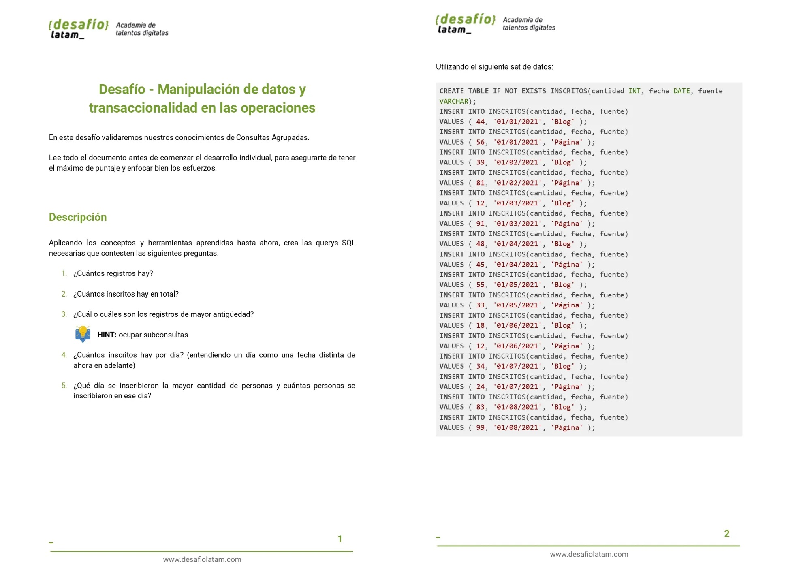
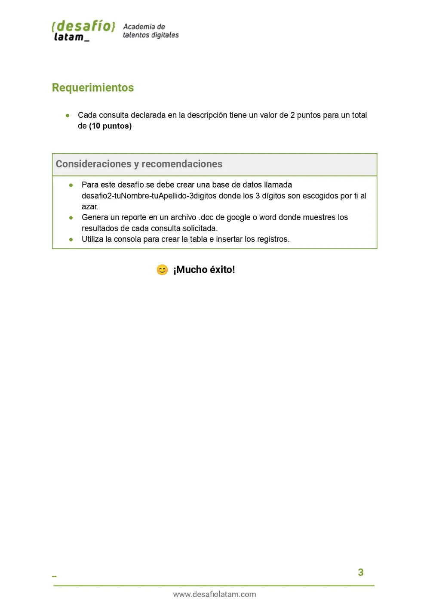

## Soluciones

### 1. ¿Cuántos registros hay?

#### 1.1-Código

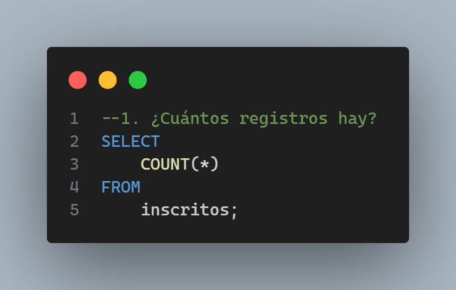

#### 1.2-Output

### 2. ¿Cuántos inscritos hay en total?

#### 2.1-Código

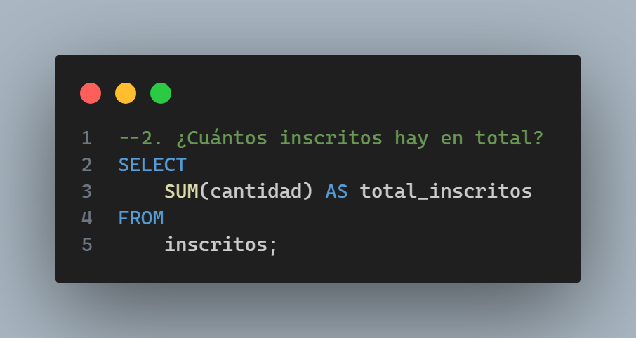

#### 2.2-Output

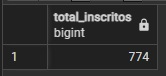

### 3. ¿Cuál o cuáles son los registros de mayor antigüedad?

#### 3.1-Código

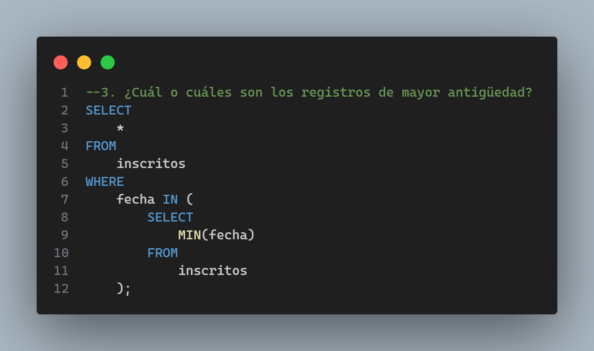

#### 3.2-Output

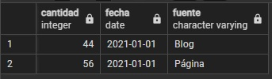

### 4. ¿Cuántos inscritos hay por día? (entendiendo un día como una fecha distinta de ahora en adelante)

#### 4.1-Código

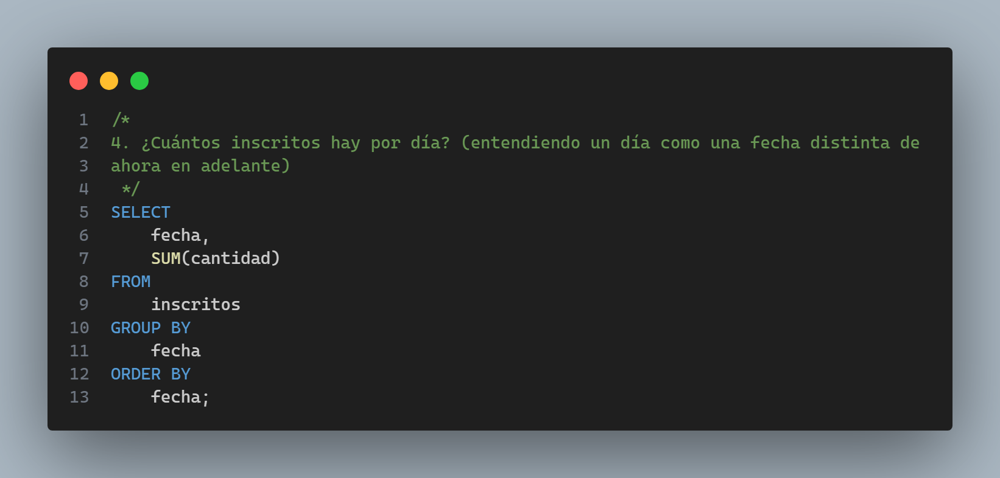

#### 4.2-Output

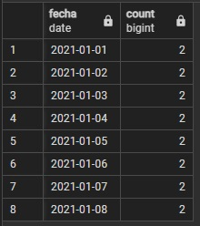

### 5. ¿Qué día se inscribieron la mayor cantidad de personas y cuántas personas se inscribieron en ese día?

#### 5.1-Código

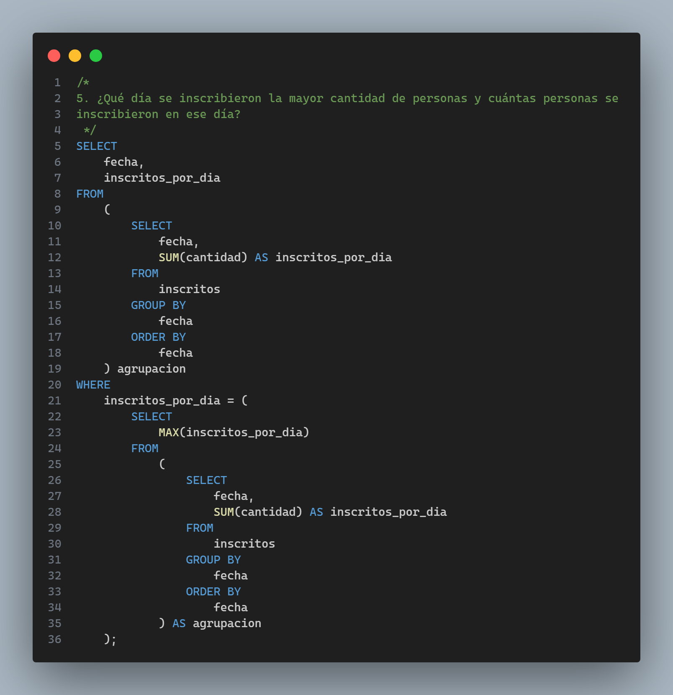

#### 5.2-Output

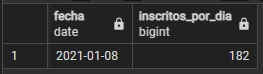

##### Forma 2

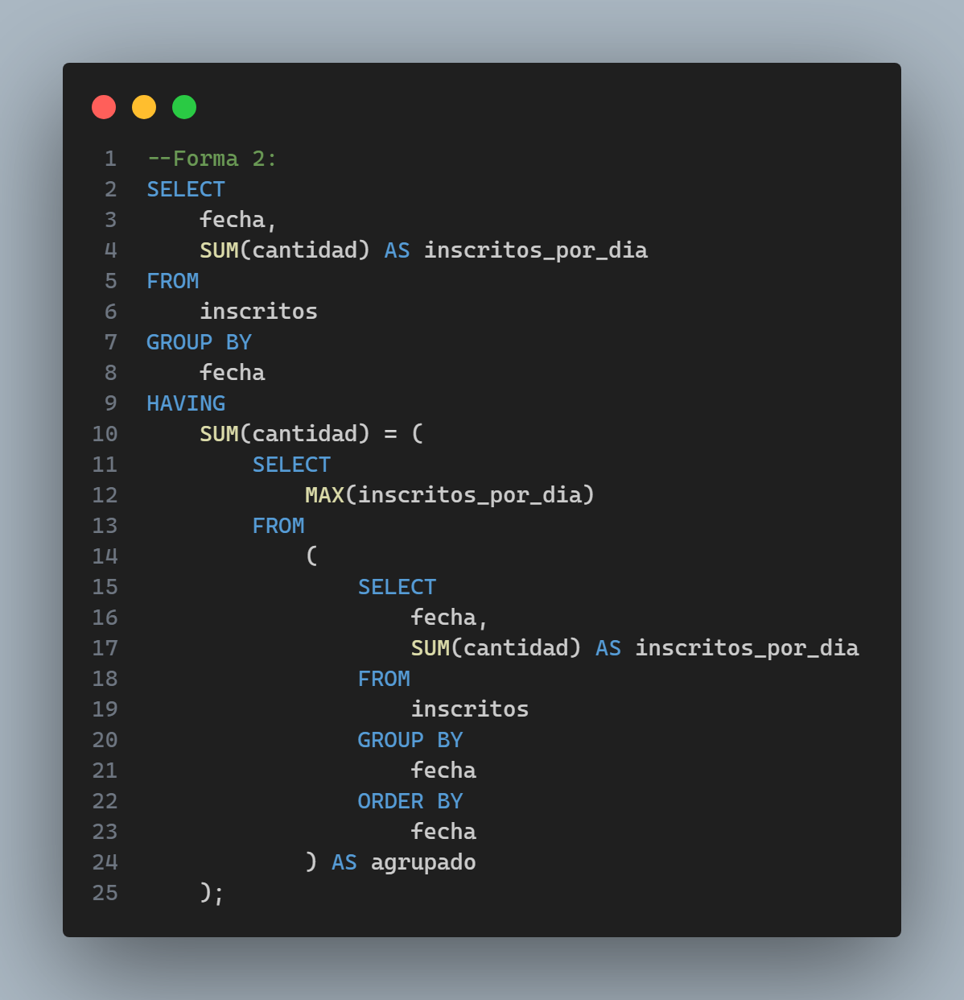

##### Forma 3

Si previa revisión de la tabla agrupada se observa que solo hay un día con la mayor cantidad de personas entonces la consulta se puede simplificar de este modo:

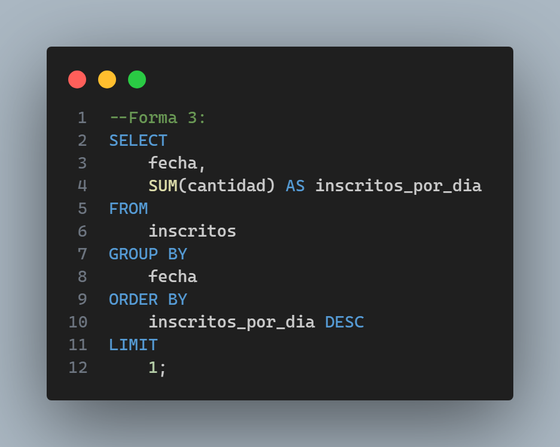
